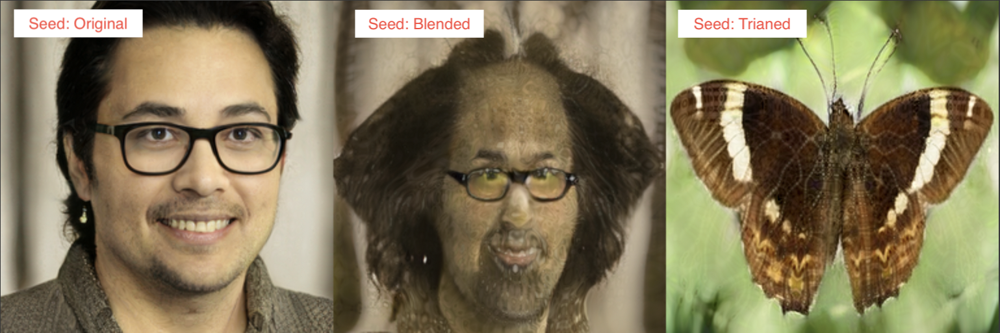

# Network Blending Interface
_Or: an interpid, but ultimately futile attempt to make GAN portraits of my friends_

## Motivation
The excitement around StyleGAN's ability to create nearly perfect artificial human faces is warrented, but I'm interested in creating images of real people. I began this project wondering how to create portraits of my friends using StyleGAN.

This idea came about while I was first experimenting with StyleGAN3 on a set of butterfly images. I noticed that some of the early steps during the transfer learning from human faces to butterflys were quite interesting: they felt expressive and painterly, and I was excited by the possibility of applying similar transformations on the people in my life: freinds, family, etc..

*Sample of transfer learned images*

I did some research into how I could achieve this goal and discovered [Justin Pinkney's](https://www.justinpinkney.com/stylegan-network-blending/) network blending blogpost. At the same time, I was reading through Memo Akten's thesis on ["Realtime Continuous, Meaningful Human Control over Deep Neural Networks for Creative Expression"](https://research.gold.ac.uk/id/eprint/30191/) as well as Terrance Broad's taxonomy on [Active Divergence](https://terencebroad.com/research/active-divergence-survey). Lastly, I was introduced to the idea of image inversion for StyleGAN and had the following plan to build meaningful control over network blending:
1. Build a user interface for fine tuned control over network blending
2. Project images of people from my life into the latent space
3. Thoughtfully blend between the real image representation and the butterfly representation for an authentic artistic expression 

In other words, my goal for this project was to use a combination of network projection and fine tuned control over network blending to create intentional, expressive portraits of real people in my life.

## Trial, But Mostly Error
### Attempt #1: StyleGAN3
_First signs of trouble_

To begin, I started with building the network bending UI workflow because I thought that would be the most challanging part of the project. The basic architectue involves a `blendModels()` function which takes a list of how much each layer in the model should be mixed (aka. a value of 0 means use only the weights from the first model, a value of 0.5 is an even mix, and 1  means all the weights from the second model. I then hooked these values up to a set of sliders as a useful interface for the blend function.

*UI to control individual blend levers per layer*

The user could then select a source model and a destination model and experiment with various blend setups for a given seed. I included an EZ blending interface for simple functions like 50% interpolation or a half way crossover. Below there are fine tuned controls over every layer. I find a useful workflow to be experimenting with the EZ controls to get a sense of what is possible with the models and then digging into the fine tune controls to realize a more intentional output.

*Example of fine tuned results you can get with the UI. In the first image, we are taking just the middle layers of from the butterfly model, but mainting the face structure and high level textures. In the second we are also using the butterfly model's high level textures.*

This system worked well...until I began experimenting with projections into the W+ space. I tried a couple algorithms, but had two major issues:
1. The projections were often unsatisfactory. This is known limitation of inversions, but is especially problematic when trying to create meaningful portraits
2. Using the projected W vector in the destination model resulted in really poor images. For example when working with seeds in the Z space in the case of the butterfly model, you'd always have a realistic human face on one side and a coherent butterfly on the other. But when using the projected W+ vector, you'd have a mostly coherent human face but a completely garbled butterfly on the other Because we are essentially blending between these two image destinations, the results just weren’t as satisfying compared with the seeds.

*Good: Source/destination pair in Z space. Both the face and butterfly are sharp.*

*Bad: Source/destination pair when projecting into W+ space. The face is not a great match and the butterfly is a shapeless blob.*

At this point I felt confident that the UI control over the network blending was indeed useful, but needed a better solution for the projection problem. I was certain it was possible due to the results from Pinkney's [toonify yourself](https://www.justinpinkney.com/toonify-yourself/) project and was aware that the architectures of StyleGAN2 and 3 are [quite different](https://github.com/yuval-alaluf/restyle-encoder/issues/45#issuecomment-943503066). My plan was to rebuild this notebook for StyleGAN2 and hope for better results.

### Attempt #2: StyleGAN2
I rebuilt the network blending UI notebook for StyleGAN2, using [dvschultz's blending logic](https://github.com/dvschultz/stylegan2-ada-pytorch/blob/main/Network_Blending_ADA_PT.ipynb) as a starting off point. The structure was essentially the same, but the blend code needed to account for the different internal structure of StyleGAN2's layers.

*StyleGAN2 EZ blend controls*

**The good news:** 
- With fewer levers to control, interacting with the blending sliders in the StyleGAN2 model felt more meaningful and predictable. 

*StyleGAN2 buttefly blend with Z seed*

**The medium new:**
- Projections in the source and destination networks were indeed more reliable. But the results still were quite lackluster. The people in the projections were just slightly too off from the original to be useful as the starting point for a portrait and the corresponding image in the destination model were less interesting than when starting with a Z seed.

**The worse news:**
- When fine tuning the FFHQ network on butterflies, the aesthetics of StyleGAN2 are just less expressive than StyleGAN3, so the blended results from these early checkpoints still didn’t match my goals.

*StyleGAN2 buttefly blend with projections*

Once again, I was satisfied with the network blending aspect of the project, but not with the projection/portrait workflow. However, before moving on from this point, I decided to have some fun with this UI.

#### **Ukiyo-e Face**
To begin, I tested my setup with the Ukiyo-e face models provided by Pinkney to ensure my setup worked as expected. It was satisfying to get similar resutls and even more fun to start playing with levers more intetionally to fine tune results.

*Results with fine tuning blending on ukiyo-e face model blending*

#### **PokéPeople**
I recently trained a StyleGAN model on Pokémon for fun and dropped that model into this notebook. I then challenged myself to try to create some PokéPeople, with both the projections of friends and random seeds:

*Right image is produced by source model, left image is corresponding image in destination model, center is the blended image*

 

*Different blends of same W+ project input*

#### **FleshéMon**
The much more fun experiment was reversing the blend direction and discovering **FleshéMon**: creatures in the shape of PokéMon but the texture of human face. The fine tuned controls over the network blend allowed me to find the ideal spot between familiar and grotesque.

#### Experimental Overblending
One more experiment was the technique of *overblending*. A blend value for any given layer should be between `[0-1]`. However, nothing is stopping us for giving the function values outside those bounds! I built another UI for overblending to see what would happen if you move above and below those bounds and while a lot of the output is garbage, there is a fun, expressive element to it.

[images]

### Attempt #3: Pix2Pix
_A possible solution_
I reviewed the [Making Toonify Yourself](https://www.justinpinkney.com/making-toonify/) blogpost and read that to create a more efficient toonify process, the author built a Pix2Pix translation between the original image and blended image.

I began an exploration into doing the same, but training is still in early stages. 

[]

Additionaly, while the results might work for real images of people in my life, I would no longer have the fine tuned control over the output image. However, I _still_ would have control over how to blend the models before creating the dataset, so it would fulfill some of my goals for this project if this direction works out.

### Attempt #4: Pixel2Style2Pixel
_The return of StyleGAN3_
When I started this project, I was somewhat naive about the possibilities of image inversion for StyleGAN. It is evidently not a solved problem, and there is active research to improve the available methods and tools. One of these is using a `Pixel2Style2Pixel` for inversion. I only began to experiment with it at the time of writing this so it's too early to tell if it's an effective method. Using the collab notebook they provide, I was excited by the speed of the inference, but the results still weren't as close to original as I would like. Additonaly, the pair for the latent vector in the transfer-learning model, was realtivly coherent, but not as sharp as a Z seed image.

[image]

## Conclusion

## Code
#### StyleGAN3 Network Blending UI
- [Repo](https://github.com/adamdavidcole/stylegan3-fun-blend)
- [Notebook](https://github.com/adamdavidcole/stylegan3-fun-blend/blob/main/blend.ipynb)

  
#### StyleGAN2 Network Blending UI
- [Repo](https://github.com/adamdavidcole/stylegan2-ada-pytorch-adam) 
- [Notebook](https://github.com/adamdavidcole/stylegan2-ada-pytorch-adam/blob/main/network_blending_gui.ipynb)

## Refrences
#### StyleGAN3 Network Blending UI
- This code lives in a fork of StyleGAN3-fun by @PDillis and we take advantage of their projection script and utilities
- Setup code was based on @dvschultz StyleGAN notebooks
- The idea to use a "blend mask" and many helper functions were taken fully from @Sxela stylegan3_blending repo
- Much of this work was inspired by Justin Pinkney's blogpost on network blending
  
#### StyleGAN3 Network Blending UI
- This code lives in a fork of StyleGAN2 by @dvschultz and we take advantage of the training, projection, blending and utility function in that repo.
- The idea to use a "blend mask" and many helper functions were taken fully from @Sxela stylegan3_blending repo
- Much of this work and some of the models were taken from Justin Pinkney's blogpost on network blending.